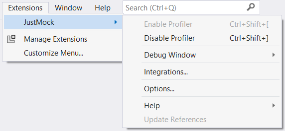
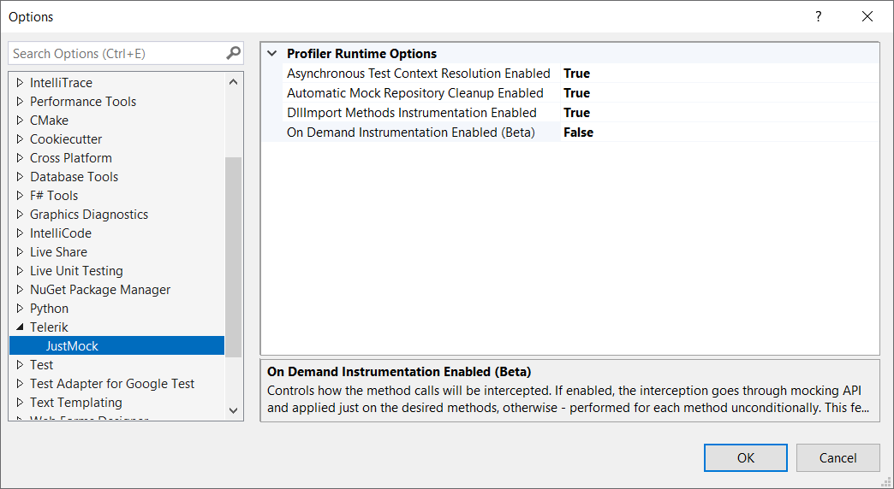
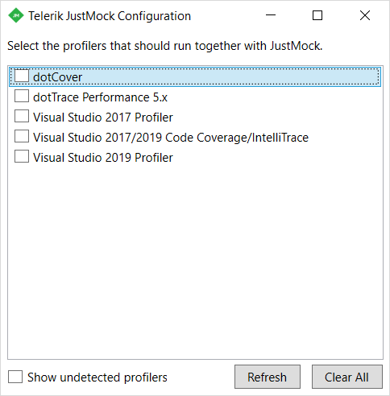
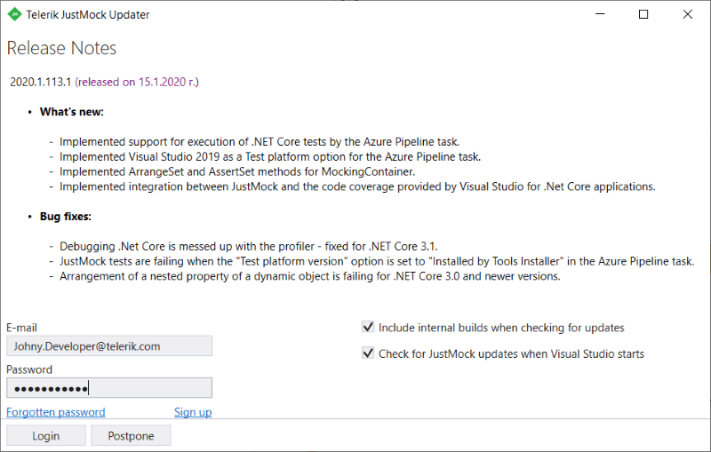
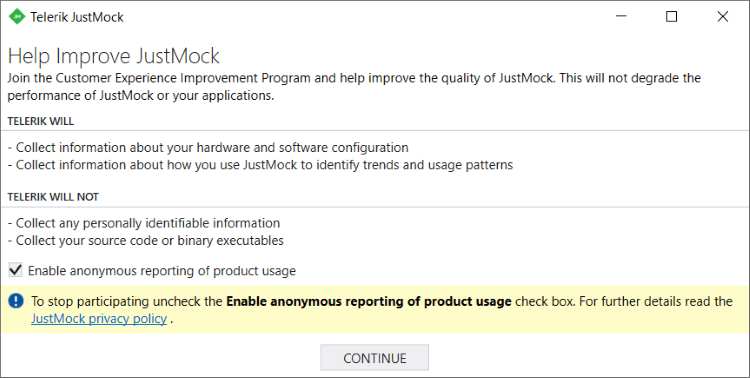

# Visual Studio Extension

When you install __Telerik® JustMock__, you also get a JustMock Visual Studio extension installed by default. It deploys a _JustMock_ menu inside Visual Studio.

#### Figure 1: JustMock Menu in Visual Studio

This article will walk you through the different settings the Visual Studio extension provides. 

## Enable/Disable Profiler

Enables or disables the JustMock profiler. The profiler is only needed when you want to use the [advanced features]() of JustMock. 

You can enable and disable the profiler using the `Ctrl+Shift+[` and `Ctrl+Shift+]` shortcuts.

## Profiler Options
Opens the Profiler Runtime Options from where you can configure what exactly should be instrumented by the JustMock profiler. Here are the available options:

#### Figure 2: JustMock Menu in Visual Studio

### On Demand Instrumentation Enabled
Controls whether the JustMock Profiler will insert the required code (code instrumentation) to work on demand. Enabling this option will lead to significantly faster execution time. Otherwise, the instrumentation will be done for each compiled method no matter if you intend to mock it or not, which of course causes the slowdown of the execution time.

> This feature is still in Beta.

Because not all methods will be instrumented two functional breaking changes arise:

1. Mocking of the [new operator](https://docs.microsoft.com/en-us/dotnet/csharp/language-reference/operators/new-operator) won't work correctly in all scenarios. As a workaround use the [IgnoreInstance](https://docs.telerik.com/devtools/justmock/advanced-usage/future-mocking#ignore-instance-for-an-expectation) method.
2. Mocking property setter with ArrangeSet(Action) won't work correctly in all scenarios. As a workaround please use the ArrangeSet&lt;PropertyOwnerType&gt;(Action) overload.

### Automatic Mock Repository Cleanup Enabled
Controls whether a call to the Mock.Reset method is instrumented by the JustMock Profiler at the end of each method. The default value is true. It is safe to be disabled only when a call to Mock.Reset is added to all unit tests that use JustMock with the purpose to clean all mock objects from the mocks repository, otherwise a memory leak can occur for those unit tests. Disabling this option will lead to faster execution time. Use with caution.

### DLLImport Method Instrumentation Enabled
Controls whether methods marked with the [DLLImport](https://docs.microsoft.com/en-us/dotnet/api/system.runtime.interopservices.dllimportattribute?view=net-6.0) attribute can be mocked. Can be safely disabled if no DLLImport methods are mocked. Disabling this option will lead to faster execution time.

### Asynchronous Test Context Resolution Enabled
Controls the test execution resolution of asynchronous test methods. Can be safely disabled when only synchronous test methods are executed. Disabling this option will lead to slightly faster execution time.

## Integrations

Opens the Telerik JustMock Configuration window, which is used to link JustMock with 3rd party profilers. For more information, navigate to [this]() article.

#### Figure 3: JustMock Configuration Window

## Documentation

Opens the online Telerik JustMock documentation. You could download an offline documentation in PDF from your [account](https://www.telerik.com/account/).

## Suggest a Feature

Opens the [JustMock Ideas and Feedback Portal](https://feedback.telerik.com/justmock) where you can submit ideas and feature requests or vote for features that are already in the backlog.

## Check for Updates

Opens the Telerik JustMock Updater window.  Gives you the options to *Include internal builds when checking for updates* and *Check for JustMock updates when Visual Studio starts*.

#### Figure 4: JustMock Updater

## Customer Experience and Improvement Program 

Opens the Telerik JustMock customer experience and improvement program window, where you can enable or disable the anonymous reporting of the product usage.

#### Figure 5: JustMock Customer Experience and Improvement Program 

## Update References 

Opens the Telerik JustMock Update References window. Provides the ability to update all JustMock references (*Telerik.JustMock.dll* and *Telerik.JustMock.Container.dll*) in the solution. Further, you can choose to not show this window again for that particular solution.

This window prompts automatically when a solution which contains JustMock references different from the currently installed JustMock version is loaded.

#### Figure 6: Update JustMock References window ####

 
The functionality to update references can also be used by right-clicking on the references field for a certain project. This way, you will be able to update only the JustMock references for that particular project: 

#### Figure 6: Update JustMock References from the context menu

## About JustMock 

Opens the Telerik JustMock about window.

## Troubleshooting

*Problem:* **Missing Telerik menu in Visual Studio**

*Reason:* Telerik Visual Studio Extensions are disabled.

*Suggested solution:*

* Open Visual Studio;

* Go to menu Tools - > Extensions and Updates...(for Visual Studio 2019 Extensions - > Manage Extensions)

* Open the Installed tab on the left​

* Search for Telerik JustMock extension and make sure it is Enabled

>important If the article does not help solving your problem, please follow these steps to generate Visual Studio [ActivityLog](https://docs.microsoft.com/en-us/visualstudio/ide/reference/log-devenv-exe?view=vs-2019) file before contacting our support:
>* Open [Developer Command prompt](https://docs.microsoft.com/en-us/dotnet/framework/tools/developer-command-prompt-for-vs) for Visual Studio 20xx under **Administrative rights**.
>* Execute the command - devenv /log %userprofile%\desktop\ActivityLog.xml . This will start Visual Studio and create logs on your Desktop.
>* Reproduce the problem
>* Attach the **Activitylog** files when you contact our support.

# See Also

 * [Installation and Setup]()

 * [Adding Telerik JustMock to Your Test Project]()

